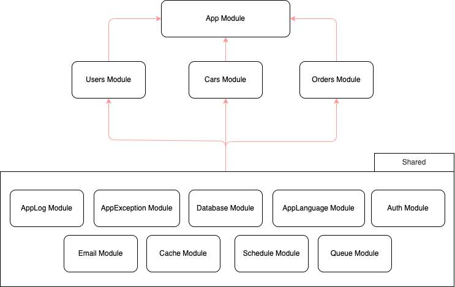
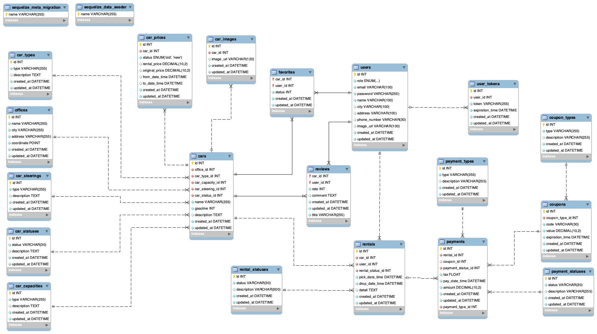

<p align="center">
  <a href="http://nestjs.com/" target="blank"></a>
</p>

[circleci-image]: https://img.shields.io/circleci/build/github/nestjs/nest/master?token=abc123def456
[circleci-url]: https://circleci.com/gh/nestjs/nest

## Author
```bash
Nguyen Duc Quy
```

## Description
```bash
Simple api for CarRent project by NestJS
```

## Create Mysql database

## Clone code
```
git clone git@github.com:vnbrew/quynd-car-rent-nestjs.git
cd quynd-car-rent-nestjs
```

## setup .env by rename templeta.env to .env and fill your information
```
DB_USERNAME=your_username
DB_PASSWORD=your_password
DB_NAME=development_database_name
DB_HOST=127.0.0.1
DB_PORT=3306
DB_DIALECT=mysql
JWT_KEY=random_secret_key
JWT_EXP_TIME=1h
BEARER=Bearer
NODE_ENV=development/staging/production
SENDGRID_KEY=https://app.sendgrid.com/settings/api_keys
REDIS_HOST=localhost
REDIS_PORT=6379
```

## Installation
```bash
$ npm install
```

## Migration

```bash
$ npm run migrate:up
$ npm run seed:up:all
```

## Running the app

```bash
# development
$ npm run start

# watch mode
$ npm run start:dev

# production mode
$ npm run start:prod
```

## Api document (Not finished yet)

[Google driver link](https://docs.google.com/spreadsheets/d/1sgKW7hwX0Z_JrDOjPHQniRuIJvCUOVtgtpDPC1furL8/edit?usp=sharing)

## Module Architecture


## Database Diagram


## License

Nest is [MIT licensed](LICENSE).
